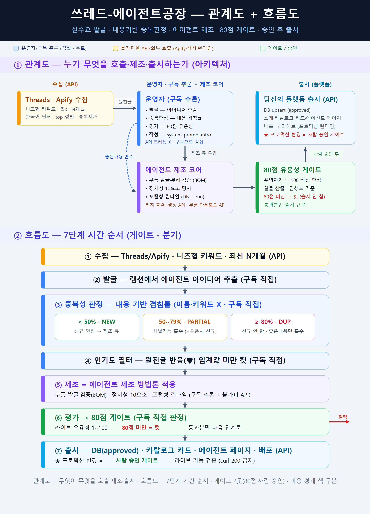

# Threads Agent Factory — 실수요를 발굴해 AI 에이전트를 자동 제조하는 공장

> 소셜(Threads)에서 사용자의 **실수요**를 발굴 → 당신의 카탈로그에 **아직 없는** 유용한 AI 에이전트만
> **에이전트 제조 방법론**으로 만들고 → **유용성 80점 게이트**를 통과한 것만 출시하는 **자가성장
> 에이전트 공장** 스킬(방법론)입니다. 사람은 마지막 출시 승인만, 나머지는 공장이 돕니다.

**English TL;DR** — A *self-growing agent factory* methodology. It mines **real user demand** from a
social feed (Threads via Apify), extracts agent ideas, and judges duplicates by **content overlap —
not keyword matching**: `<50%` = new, `50–79%` = absorb the differentiator, `≥80%` = duplicate (still
absorb any good idea into the existing agent). Surviving candidates are built with an **agent
manufacturing method** (parts discovery + verification + 10-element identity), then scored 1–100 for
live usefulness — **only ≥80 ships**, behind a human approval gate. The core principle: **run all
reasoning (discovery, dedup, evaluation, writing) on your subscription LLM for free; spend API/credits
only where unavoidable** — collection, asset generation, and production runtime.



---

## 동작 흐름 (7단계 · 게이트 2곳)

```
[Threads 원천글]
   │  ① 수집  (API: Apify · 니즈형 키워드 · 최신 N개월 · 한국어 필터)
   ▼
   ② 발굴      → 캡션에서 에이전트 아이디어 추출           (구독 추론 · 직접)
   ▼
   ③ 중복성 판정 (내용 기반 겹침률 · 이름/키워드 X)         (구독 추론 · 직접)
       ├─ < 50%  · NEW     → 신규 인정, 제조 큐
       ├─ 50~79% · PARTIAL → 차별 기능 흡수 (+유용하면 신규)
       └─ ≥ 80%  · DUP     → 신규 안 함, 좋은 내용만 기존에 흡수
   ▼
   ④ 인기도 필터 → 원천글 반응(♥) 임계값 미만 컷            (구독 추론 · 직접)
   ▼
   ⑤ 제조       → 에이전트 제조 방법론 (부품 발굴·검증 + 정체성 10요소 + 포털형 런타임)
   ▼
   ⑥ 80점 게이트 → 라이브 유용성 1~100 직접 판정 · 80점 미만 컷  (구독 추론 · 직접)
   ▼
   ⑦ 출시       → 카탈로그 등재 + 페이지 + 배포  ★ 프로덕션 변경 = 사람 승인 게이트
   ▼
[라이브 — 기능 검증 후 운영]
```

## 7단계 파이프라인

| 단계 | 무엇을 | 누가 / 비용 |
|---|---|---|
| ① 수집 | 니즈형 키워드로 Threads 글 수집 (최신 N개월·한국어·인기순) | API (Apify) |
| ② 발굴 | 캡션에서 에이전트/스킬 아이디어 추출 (홍보·밈·정치 제외) | 구독 추론 · 직접 |
| ③ 중복성 판정 | **내용 기반 겹침률**로 NEW/PARTIAL/DUP 분류 | 구독 추론 · 직접 |
| ④ 인기도 필터 | 원천글 반응(♥) 임계값 미만 컷 | 구독 추론 · 직접 |
| ⑤ 제조 | 에이전트 제조 방법론 (BOM·부품 검증·정체성 10요소·포털형) | 구독 추론 + 불가피 API |
| ⑥ 80점 게이트 | 라이브 유용성 1~100 판정, 80점 미만 컷 | 구독 추론 · 직접 |
| ⑦ 출시 | 카탈로그 등재·페이지·배포 (**사람 승인 게이트**) | API (배포·런타임) |

## 핵심 차별점

| 항목 | 보통의 접근 | 이 공장 |
|---|---|---|
| 중복 판정 | 이름·키워드 매칭 | **기능 내용 기반 겹침률** (핵심기능·산출물·입력·도메인·차별점) |
| 중복 처리 | 버림 | **흡수(MERGE)** — 좋은 아이디어는 기존 에이전트에 반영 |
| 난이도 컷 | "무거우면 제외" | **제외 안 함** — 유용하면 만들고, 취사는 80점 게이트가 |
| 비용 | API 크레딧으로 추론 | **추론은 구독으로 직접, API는 불가피한 것만** |

자세한 방법론: [`docs/방법론_설명서.md`](docs/방법론_설명서.md)

---

## ⚠️ 비용 원칙 (가장 중요)

- **LLM 추론(발굴·중복판정·평가·작성)은 구독 LLM으로 직접** 한다 — API 크레딧으로 추론을 돌리지 않는다.
- **API/외부 호출은 불가피한 것만**: ① 소셜 수집(Apify) ② 부품 실다운로드·이미지/영상/음성 생성·웹검색
  ③ 프로덕션 런타임(출시 후 검증).

이 한 줄이 공장 경제성의 핵심입니다. 다이어그램의 색 구분(파랑=구독 직접 / 노랑=API)이 이 경계입니다.

---

## 설치 / 적용

> 이 저장소는 **방법론과 다이어그램**을 공개합니다. 코드 런타임이 아니라, 당신의 플랫폼·카탈로그에
> 맞게 적용하는 **운영 스킬(SKILL.md)** 형태입니다.

1. [`SKILL.md`](SKILL.md) 를 Claude Code 스킬 디렉터리(`~/.claude/skills/threads-agent-factory/`)에 배치.
2. 수집 단계는 소셜 스크레이퍼(예: Apify Threads 액터)의 토큰을 환경변수로 준비. **토큰·키 값은 저장소에 넣지 마세요.**
3. ③~⑥ 단계(발굴·중복판정·평가)는 **사람이 구독 LLM으로 직접** 수행. ⑤ 제조는 에이전트 제조 방법론을 따른다.
4. ⑦ 출시는 당신의 플랫폼 배포 절차에 연결하되, **프로덕션 변경 앞에 사람 승인 게이트**를 둔다.

## 사용법

```text
1) 키워드(니즈형) · 기간(months) · 인기도 임계값(♥) · 합격선(80) · 제조 개수 결정
2) ① 수집 (API)  → ② 발굴  → ③ 중복성 판정  → ④ 인기도 필터
3) ⑤ 제조 (에이전트 제조 방법론)  → ⑥ 80점 게이트
4) 통과분만 → ⑦ 출시 (사람 승인 후 배포)
```

- 기본 파라미터: `months=3` · `like_threshold=10` · `pass_score=80` · `max_manufacture=운영자 지정`
- 키워드는 니즈·페인·실활용형으로. 개발자 도구명(특정 CLI·프로토콜 등)은 잡음이라 제외 권장.

---

## 동작 메모 / 한계

- **반자동입니다.** 발굴·판정·평가는 사람(운영자)이 구독 LLM으로 직접 수행하고, 출시는 사람 승인을 거칩니다.
  완전 무인(cron)이 필요하면 이 공장을 핵심으로 자율 실행 에이전트를 별도로 만들 수 있습니다.
- **중복성 판정은 사람 판단**입니다. 자동 임베딩 유사도로 대체하면 빠르지만, "내용 겹침"의 뉘앙스(차별점·흡수
  가치)는 사람 판단이 더 정확합니다. 이 공장은 후자를 택했습니다.
- **자기검증 회피**: 80점 게이트 판정과 출시 후 검증은 분리합니다. 만든 사람이 자기 산출물을 "통과"시키지
  않도록, 평가·출시 검증 주체를 나눕니다.
- **UI 검증 철칙**: 출시 후 `curl 200` 만으로 "동작함" 판정 금지. 실제 라이브 화면에서 기능(실행 산출)을
  확인합니다.
- **플랫폼 의존부 제거**: 이 공개본은 특정 플랫폼의 DB 스키마·카탈로그 데이터·에이전트 코드표를 포함하지
  않습니다. "당신의 카탈로그/플랫폼"으로 일반화되어 있으니 자기 환경에 맞게 연결하세요.
- **비밀정보 금지**: Apify 토큰·DB 키·API 키·`.env` 값은 저장소에 절대 넣지 마세요. 참조 문구만 둡니다.

## License
MIT — see [LICENSE](LICENSE).
